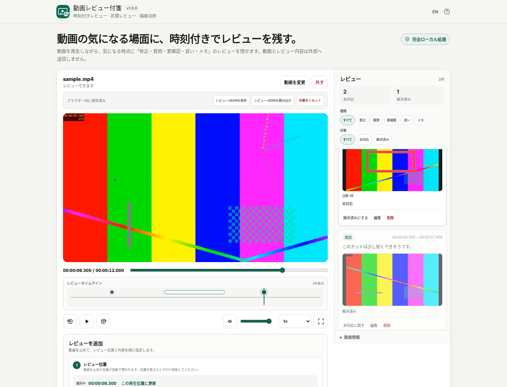

# Video Review Notes / 動画レビュー付箋

[](https://github.com/ttomohisa/htmlapps-video-review-notes/actions/workflows/deploy-pages.yml)
[](LICENSE)
[](https://ttomohisa.github.io/htmlapps-video-review-notes/)

[English README](README.md)

動画を外部へアップロードせず、ブラウザー内で再生しながら、特定時点・区間へのレビューとフレーム注釈を残せる単一HTMLアプリです。

## 🚀 デモ

### [GitHub PagesでVideo Review Notesを開く](https://ttomohisa.github.io/htmlapps-video-review-notes/)

GitHub Pagesから最初のHTMLを読み込んだ後、動画再生、レビュー編集、フレーム取得、注釈、自動保存、書き出しは端末内で処理されます。選択した元動画をアプリがサーバーへアップロードすることはありません。

[](https://ttomohisa.github.io/htmlapps-video-review-notes/)

## 主な機能

- **特定時点と区間の両方をレビュー** — 再生位置への点レビューだけでなく、「ここから → ここまで」で一定区間への指示を残せます。
- **フレーム上で対象箇所を明示** — レビュー位置のフレームを取得し、矩形・矢印・フリーハンドを6色から選んで描けます。
- **レビューを整理して追跡** — 修正 / 質問 / 要確認 / 良い / メモの5種類と、未対応 / 解決済みを使い分けられます。
- **タイムラインからすぐ移動** — 点レビューはピン、区間レビューは帯として表示し、選択すると該当位置へ移動します。
- **元動画を保存せず作業を再開** — レビュー、縮小サムネイル、注釈、フィルター、再生設定だけをIndexedDBへ自動保存します。
- **クラウドレビューサービスなしで受け渡し** — 単一HTMLレビュー、Markdown、UTF-8 CSV、レビューJSON、クリップボードへ書き出せます。
- **完全ローカル処理の単一HTML** — runtime CDN、analytics、telemetry、外部APIを使わず、CSPは `connect-src 'none'` です。

## すぐに使う

### Webで使う

[デモを開く](https://ttomohisa.github.io/htmlapps-video-review-notes/)だけで利用できます。インストールやアカウント登録は不要です。

### 単一HTMLをダウンロードして使う

1. このリポジトリから `dist/index.html` をダウンロードします。
2. 現行ブラウザーで開きます。
3. 端末内の動画を選択してレビューを開始します。

元動画はローカルの `File` / Blob URLとして扱われ、アプリからアップロードされません。

### ビルドして使う（advanced）

1. このリポジトリをダウンロードまたはクローンします。
2. Windowsで `build-standalone.bat` を実行します。
3. 生成された `dist/index.html` または `dist/index.self-extract.html` を利用します。

このアプリには第三者runtime依存がありません。利用時にアプリ用ライブラリを外部から取得する必要はありません。ビルドはBrowser Kittyの単一HTMLテンプレートとWindows PowerShellのツールを使用します。

## 使い方

1. **動画を選択**またはDrag & Dropで動画を1本追加します。
2. 動画を再生し、レビューしたい場所でプレビューをクリックして一時停止します。再生中はメインの再生ボタンも一時停止アイコンへ切り替わります。
3. **レビュー位置**で「この時点」または「区間」を選びます。区間では「ここから」で開始位置を決め、動画を進めて「ここまで」で終了位置を決めます。
4. 修正 / 質問 / 要確認 / 良い / メモを選び、**必須のコメント**を入力します。未入力の間は「レビューを追加」が使えない理由を画面に表示します。
5. 必要なら取得されたフレームに矩形・矢印・フリーハンドを描き、注釈色を選びます。
6. レビューを追加します。レビューカード、タイムラインのピン / 帯を選ぶと、そのレビューの開始位置へ移動できます。
7. 種類・未対応 / 解決済みで絞り込み、必要に応じて編集、解決済みへの変更、削除を行います。
8. レビューはブラウザー内へ自動保存されます。持ち運べるバックアップが必要な場合は**レビューJSONを保存**します。
9. **レビューを書き出す**から、単一HTML、Markdown、CSV、JSONを保存したり、レビュー一覧をテキストとしてコピーできます。

### レビュー範囲

- **この時点** — 動画内の1つの時刻を保存します。
- **区間** — 開始と終了の時刻を保存します。終了位置は開始位置より後である必要があります。
- 区間レビューでは開始位置のフレームをサムネイルとして使用します。

### フレーム注釈

利用できる描画:

- 矩形
- 矢印
- フリーハンド

利用できる色:

- グリーン
- レッド
- イエロー
- ブルー
- ホワイト
- ブラック

注釈はサムネイルへ焼き込まず、正規化したベクター座標として保持します。

### キーボード操作

| ショートカット | 操作 |
| --- | --- |
| `Space` | 再生 / 一時停止 |
| `←` / `→` | 5秒戻る / 進む |
| `Shift` + `←` / `→` | 10秒戻る / 進む |
| `F` | 全画面 |
| `M` | 現在の再生位置でレビュー入力を開始 |

フォームへ文字入力中は、通常の文字入力を優先し、ショートカットを誤発火させません。

## レビューの書き出し

### Standalone Review HTML

レビュー受け渡しの主出力です。1つのHTMLに以下を含みます。

- レビュー件数
- 時刻 / 区間
- 種類と状態
- コメント
- レビュー用縮小サムネイル
- ベクター注釈
- 種類 / 状態フィルター
- サムネイル拡大
- `ArrowLeft` / `ArrowRight` による表示中レビューの前後移動

**元動画そのものは出力HTMLへ埋め込みません。**

### その他の形式

- **Markdown** — 時刻順のレビュー、種類 / 状態、コメント
- **CSV** — 表計算ソフトで扱いやすいUTF-8 BOM付きCSV
- **レビューJSON** — `schemaVersion: 1` のレビュー / プロジェクトデータ
- **クリップボード** — チャットやメールへ貼り付けやすいテキスト

## GitHub Pagesで公開する

このリポジトリには、単一HTMLをビルドしてGitHub Pagesへ公開するワークフローが含まれています。

1. リポジトリ名を `htmlapps-video-review-notes` としてGitHubへプッシュします。
2. **Settings → Pages → Build and deployment → Source** で **GitHub Actions** を選択します。
3. `main` へプッシュするか、Actions画面からPagesのワークフローを手動実行します。
4. 成功後、`https://ttomohisa.github.io/htmlapps-video-review-notes/` で利用できます。

Pages版では最初のHTML配信は発生しますが、その後にユーザーが選択した動画をアプリがアップロードすることはありません。

## 開発とビルド

```text
.
├─ src/index.template.html       # アプリ本体のテンプレート
├─ app.config.json               # アプリ情報とビルド設定
├─ dependencies.json             # runtime依存定義（このアプリでは空）
├─ dependencies.lock.json        # 依存ロック情報
├─ build-standalone.bat          # Windows用ビルド入口
├─ build-standalone.ps1          # 単一HTML生成処理
├─ scripts/check-repository.ps1  # リポジトリ / ビルド検証
├─ assets/favicon.svg            # 正式アプリアイコン
└─ dist/
   ├─ index.html                 # 通常の完全内包HTML
   └─ index.self-extract.html    # 圧縮した自己展開HTML
```

Windows / PowerShellでリポジトリ確認を実行します。

```powershell
./scripts/check-repository.ps1
```

単一HTMLだけを再生成する場合:

```powershell
./build-standalone.ps1
```

`dist` の生成物を直接編集せず、`src/index.template.html` を変更して再ビルドしてください。

## プライバシーと通信防止

Video Review Notesは完全ローカル処理を前提にしています。

- 選択動画はローカルの `File` / Blob URLとして開きます。
- 元動画をアプリから外部サーバーへアップロードしません。
- 元動画のバイト列をlocalStorage、IndexedDB、レビューJSONへ保存しません。
- 自動保存ではレビュー、縮小サムネイル、注釈、フィルター、再生設定をIndexedDBへ保存する場合があります。
- analytics、telemetry、外部API、外部フォント、runtime CDNを使用しません。
- 生成HTMLのContent Security Policyは `connect-src 'none'` です。
- Standalone Review HTMLもruntime外部通信を必要としません。

自動保存した作業を再開するときは元動画を選び直します。保存時とファイル名・サイズ・更新日時が異なる場合は、レビューを関連付ける前に確認します。

## 対応動画と制限事項

再生できるかどうかは拡張子だけではなく、現在のブラウザーが動画内部のcodecへ対応しているかで決まります。

主要確認対象:

- MP4（H.264 / AACなどブラウザーが対応する構成）
- WebM

制限事項:

- MOVなども内部codecをブラウザーが再生できる場合のみ利用できます。
- 非対応動画をFFmpeg / WASMで自動変換する機能はありません。
- レビュー時刻はブラウザーの動画再生 / seekを基準にしており、フレームアキュレート編集ツールとしては扱いません。
- Standalone Review HTMLには意図的に元動画を含めません。
- レビューサムネイルが非常に多い場合、ブラウザーの保存容量上限によって自動保存が影響を受けることがあります。
- 大容量・高解像度動画は、動画全体をJavaScriptメモリへ複製しない設計ですが、ブラウザーや端末のデコード性能・メモリ上限の影響を受けます。
- クラウド共同編集、アカウント、ライブチャット、URL共有、動画編集、外部動画編集ソフト連携はv1.0の対象外です。

## ブラウザー対応

主対象:

- Chrome
- Edge
- Android Chrome

Safari / Firefoxも、利用するメディアAPI、Fullscreen、IndexedDB、File APIが利用できる範囲で対応します。動画codecの対応状況はブラウザー / OSによって異なります。

## 使用ライブラリ

Video Review Notes v1.0.0では**第三者runtimeライブラリを使用していません**。動画再生、Canvas取得、IndexedDB、ファイル操作、描画入力、書き出しにはブラウザーAPIを使用します。

詳細は [THIRD_PARTY_NOTICES.md](THIRD_PARTY_NOTICES.md) を確認してください。

## コントリビューション

バグ報告や機能提案はIssueからお願いします。開発への参加方法は [CONTRIBUTING.md](CONTRIBUTING.md) を確認してください。

## ライセンス

Copyright © 2026 ttomohisa

このプロジェクトは [MIT License](LICENSE) で公開されています。
