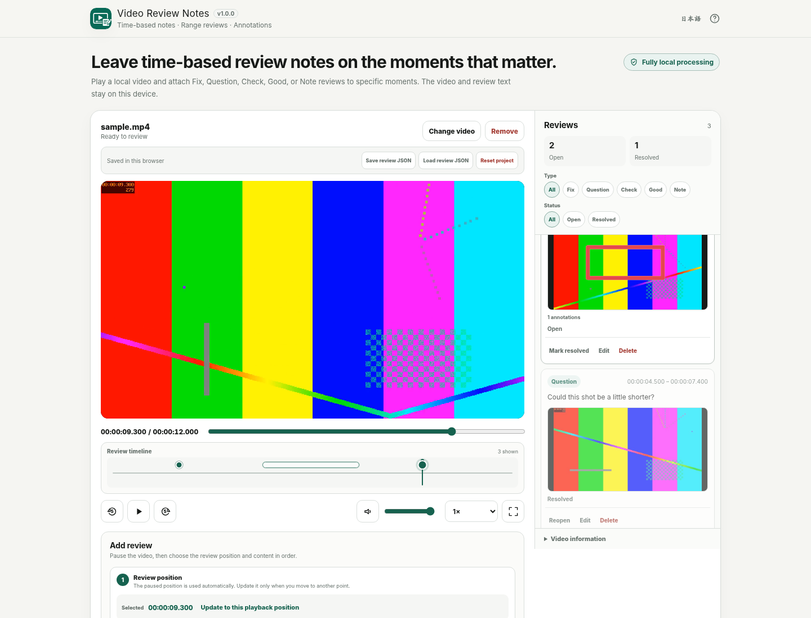

# Video Review Notes

[](https://github.com/ttomohisa/htmlapps-video-review-notes/actions/workflows/deploy-pages.yml)
[](LICENSE)
[](https://ttomohisa.github.io/htmlapps-video-review-notes/)

[日本語版 README](README.ja.md)

A privacy-focused, single-HTML video review app for adding time-based point/range notes and frame annotations without uploading the source video to a server.

## 🚀 Live demo

### [Open Video Review Notes on GitHub Pages](https://ttomohisa.github.io/htmlapps-video-review-notes/)

GitHub Pages delivers the initial HTML. After it loads, video playback, review editing, thumbnail capture, annotations, autosave, and export are processed locally on your device. The source video you select is not uploaded by the app.

[](https://ttomohisa.github.io/htmlapps-video-review-notes/)

## Features

- **Review exact moments or time ranges** — Add point reviews at a playback position or mark a start/end range for feedback that applies across a section.
- **Show exactly what you mean on the frame** — Capture the review frame and add rectangle, arrow, or freehand annotations in one of six colors.
- **Keep review work organized** — Use Fix, Question, Check, Good, or Note, switch reviews between Open and Resolved, and filter the list and timeline together.
- **Jump through feedback from the timeline** — Point reviews appear as pins and range reviews as bars; selecting either seeks the video to that review.
- **Resume without storing the source video** — Reviews, resized thumbnails, annotations, filters, and playback settings autosave in IndexedDB. Re-select the original video to resume later.
- **Hand off the result without a cloud review service** — Export a standalone review HTML, Markdown, UTF-8 CSV, review JSON, or copy the review list as text.
- **Private, single-HTML operation** — No runtime CDN, analytics, telemetry, or external API. Runtime CSP uses `connect-src 'none'`.

## Quick start

### Use the web demo

Just [open the demo](https://ttomohisa.github.io/htmlapps-video-review-notes/). No installation or account is required.

### Use the standalone file

1. Download `dist/index.html` from this repository.
2. Open it in a current browser.
3. Choose a local video and start reviewing.

The source video remains a local `File` / Blob URL. The app does not upload it.

### Build a fresh standalone file (advanced)

1. Download or clone this repository.
2. Run `build-standalone.bat` on Windows.
3. Use the generated `dist/index.html` or `dist/index.self-extract.html`.

The current app has no third-party runtime dependency, so no application library needs to be fetched during use. The build uses the Browser Kitty single-HTML template and Windows PowerShell tooling.

## Usage

1. Add one local video with **Choose video** or drag and drop.
2. Play the video and click the preview to pause at the moment you want to review. The main play button changes to a pause icon while playback is active.
3. In **Review position**, choose **This moment** or **Range**. For a range, set **Start here**, move through the video, then set **End here**.
4. Choose Fix / Question / Check / Good / Note and enter the required comment. The app clearly shows when the comment is still required before **Add review** becomes available.
5. Optionally add a rectangle, arrow, or freehand annotation to the captured frame and choose an annotation color.
6. Add the review. Select a review card, timeline pin, or range bar to jump back to its start time.
7. Filter by review type and Open / Resolved status. Edit, resolve/reopen, or delete reviews as needed.
8. Reviews autosave locally. Use **Save review JSON** when you want a portable project backup.
9. Use **Export reviews** to save a standalone review HTML, Markdown, CSV, or JSON, or copy the review list as plain text.

### Review modes

- **This moment** stores one video time.
- **Range** stores a start and end time. The end must be later than the start.
- Range reviews use the start frame as their review thumbnail.

### Frame annotations

Available tools:

- Rectangle
- Arrow
- Freehand

Available colors:

- Green
- Red
- Yellow
- Blue
- White
- Black

Annotations are stored as normalized vector coordinates rather than being permanently burned into the base thumbnail.

### Keyboard shortcuts

| Shortcut | Action |
| --- | --- |
| `Space` | Play / pause |
| `←` / `→` | Move 5 seconds backward / forward |
| `Shift` + `←` / `→` | Move 10 seconds backward / forward |
| `F` | Fullscreen |
| `M` | Start a review at the current playback position |

Keyboard shortcuts do not override normal text entry while a form field is focused.

## Review exports

### Standalone Review HTML

The primary handoff format. It contains:

- Review counts
- Timecodes / ranges
- Type and status
- Comments
- Derived review thumbnails
- Vector annotation overlays
- Type / status filters
- Thumbnail zoom
- `ArrowLeft` / `ArrowRight` navigation through visible reviews

The source video itself is **not** embedded in the exported HTML.

### Other formats

- **Markdown** — ordered timecodes, type/status, and comments
- **CSV** — UTF-8 with BOM for spreadsheet use
- **Review JSON** — portable review/project data using `schemaVersion: 1`
- **Clipboard text** — quick handoff to chat or email

## Publish with GitHub Pages

The repository includes a workflow for building the standalone HTML and deploying it to GitHub Pages.

1. Push the repository to GitHub as `htmlapps-video-review-notes`.
2. Open **Settings → Pages → Build and deployment → Source** and select **GitHub Actions**.
3. Push to `main`, or run the Pages workflow manually from the Actions tab.
4. After a successful deployment, the app is available at `https://ttomohisa.github.io/htmlapps-video-review-notes/`.

The Pages version requires the initial HTML request. The video selected afterward is handled locally by the app and is not uploaded.

## Development and build layout

```text
.
├─ src/index.template.html       # Application source template
├─ app.config.json               # App identity and build options
├─ dependencies.json             # Runtime dependency declaration (empty for this app)
├─ dependencies.lock.json        # Dependency lock metadata
├─ build-standalone.bat          # Windows build entry point
├─ build-standalone.ps1          # Standalone HTML builder
├─ scripts/check-repository.ps1  # Repository / build verification
├─ assets/favicon.svg            # Canonical app icon
└─ dist/
   ├─ index.html                 # Readable self-contained app
   └─ index.self-extract.html    # Compressed self-extracting app
```

Run the repository checks on Windows / PowerShell:

```powershell
./scripts/check-repository.ps1
```

Or rebuild the standalone outputs directly:

```powershell
./build-standalone.ps1
```

Edit `src/index.template.html`, not generated files in `dist`.

## Privacy and runtime network protection

Video Review Notes is designed for local processing.

- The selected video is opened through a local `File` / Blob URL.
- The source video is not uploaded by the app.
- The source video bytes are not stored in localStorage, IndexedDB, or project JSON.
- Reviews, resized thumbnails, annotations, filters, and playback settings can be stored in IndexedDB for autosave.
- The app uses no analytics, telemetry, external API, external font, or runtime CDN.
- The generated HTML uses a Content Security Policy with `connect-src 'none'`.
- Standalone Review HTML exports also contain no runtime network dependency.

To resume autosaved work, select the source video again. If the filename, size, or modification time differs from the saved metadata, the app asks before attaching the saved reviews.

## Supported video and limitations

Playback depends on the codecs supported by the current browser, not only the file extension.

Primary verification targets:

- MP4 using browser-supported codecs such as H.264 / AAC
- WebM

Limitations:

- MOV and other containers work only when the browser supports the codecs inside them.
- The app does not transcode unsupported video with FFmpeg/WASM.
- Review timing follows browser media playback/seeking; this is not advertised as a frame-accurate editing tool.
- The source video is intentionally omitted from standalone review HTML exports.
- Browser storage limits can affect autosave when a project contains many review thumbnails.
- Very large or high-resolution source videos remain subject to browser/device decode and memory limits, although the app does not copy the full source into JavaScript memory.
- Cloud collaboration, accounts, live chat, URL sharing, video editing, and NLE integrations are outside the v1.0 scope.

## Browser support

Primary targets:

- Chrome
- Edge
- Android Chrome

Safari and Firefox are supported where the required media, fullscreen, IndexedDB, and file APIs are available. Actual video codec support varies by browser and operating system.

## Dependencies

Video Review Notes v1.0.0 uses **no third-party runtime library**. Playback, canvas capture, IndexedDB, file handling, drawing input, and export use browser APIs.

See [THIRD_PARTY_NOTICES.md](THIRD_PARTY_NOTICES.md) for the dependency notice.

## Contributing

Bug reports and feature proposals are welcome through GitHub Issues. See [CONTRIBUTING.md](CONTRIBUTING.md) for development guidance.

## License

Copyright © 2026 ttomohisa

Licensed under the [MIT License](LICENSE).
